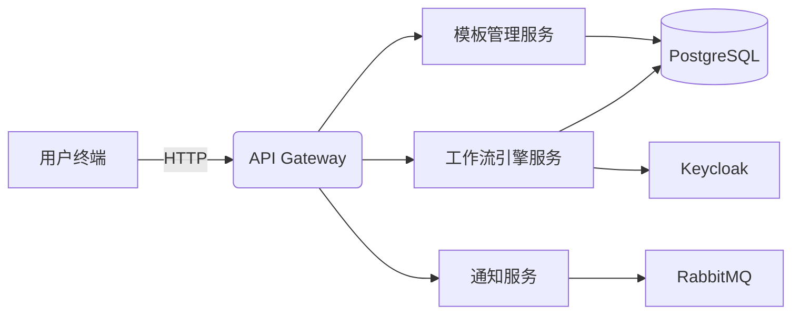
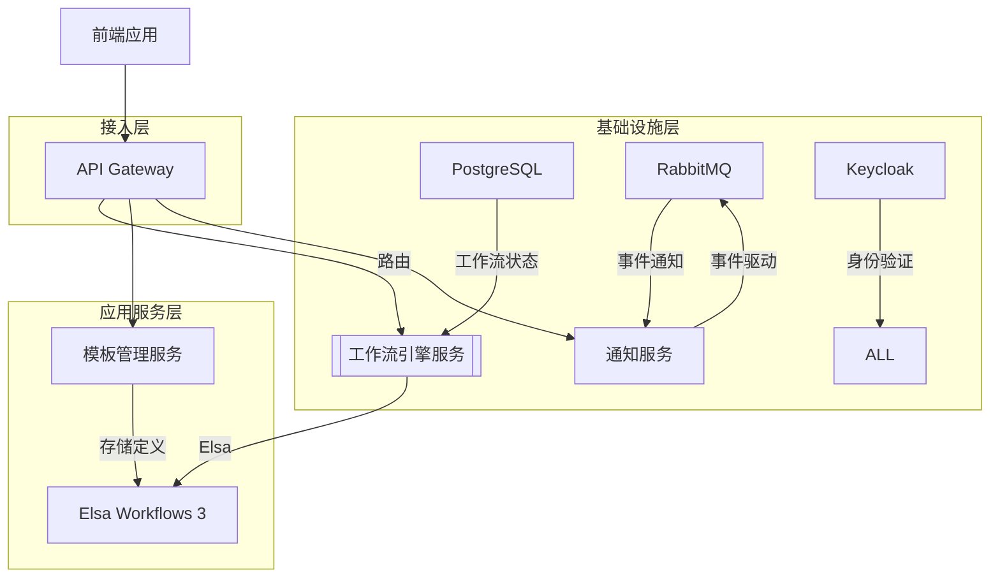
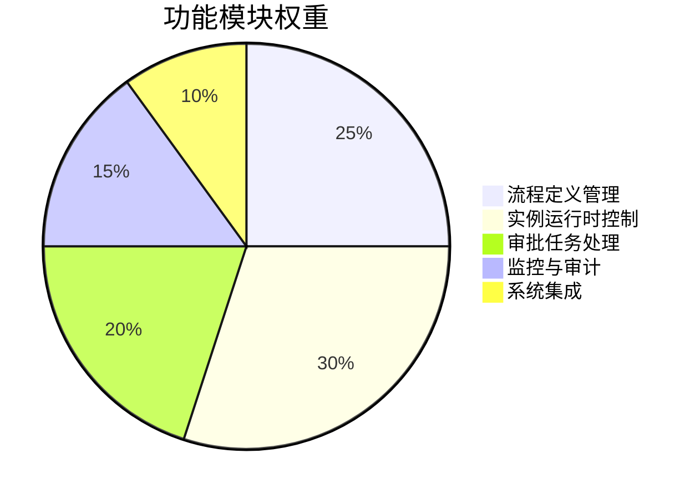
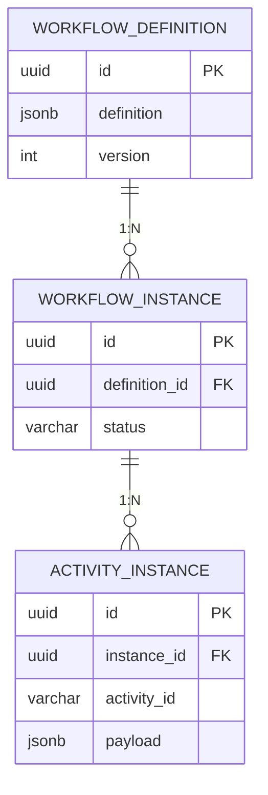
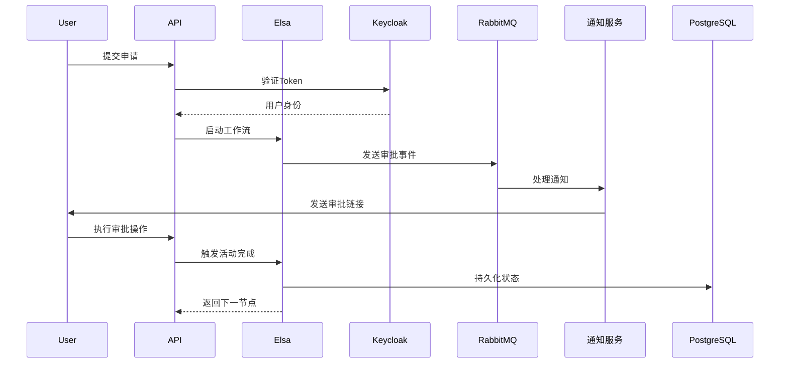
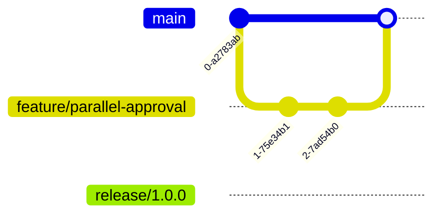
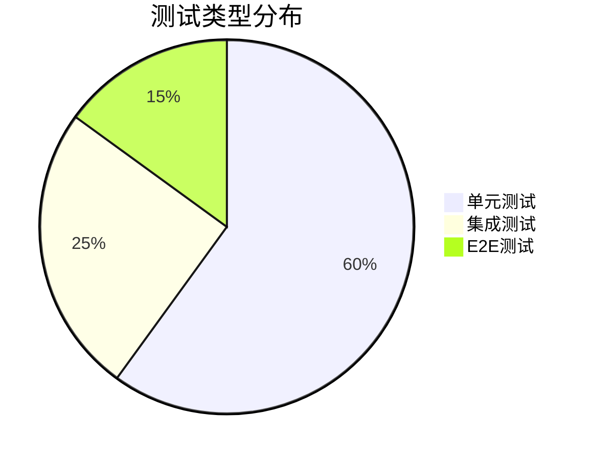

# 审批流系统开发设计文档

## 1. 项目概述
### 1.1 系统目标
构建基于微服务架构的智能审批流平台，支持多场景动态审批流程（请假/报销/采购等），实现以下核心能力：
- 可视化流程配置（支持并行审批、条件分支等复杂模式）
- 自动化流程驱动（通过事件触发+人工审批混合模式）
- 企业级安全控制（RBAC权限体系+审计追溯）
- 实时状态监控与业务数据分析

### 1.2 系统边界



## 2. 技术选型
| 技术栈          | 版本       | 用途说明                          | 关键能力                     |
|-----------------|------------|-----------------------------------|----------------------------|
| .NET Core       | 9.0        | 后端开发框架                      | 高性能、跨平台、云原生支持   |
| PostgreSQL      | 16         | 主数据库                          | JSONB支持工作流定义存储      |
| Elsa Workflows  | 3.2        | 工作流引擎                        | 动态流程控制、可视化设计器   |
| RabbitMQ        | 3.12       | 消息队列                          | 服务解耦、事件驱动架构       |
| ASP.NET Aspire  | 0.5        | 服务编排框架                      | 服务发现、健康检查、观测性   |
| Keycloak        | 22.0       | 身份认证与授权                    | OAuth2/OIDC、多租户支持     |
| Seq             | 2024.1     | 日志聚合                          | 结构化日志查询与分析         |

## 3. 系统架构
### 3.1 逻辑架构


### 3.2 物理部署
| 组件                | 实例数 | 资源配置 | 部署模式      |
|---------------------|--------|----------|---------------|
| API Gateway         | 2      | 2C4G     | 主动-主动     |
| 工作流引擎服务      | 3      | 4C8G     | 无状态集群    |
| PostgreSQL          | 1主2从 | 8C16G    | 同步复制      |
| RabbitMQ            | 3节点  | 4C8G     | 镜像队列      |

## 4. 功能设计
### 4.1 核心功能模块


### 4.2 功能清单
| 模块           | 功能点                     | 技术实现                                 |
|----------------|---------------------------|----------------------------------------|
| 模板管理       | 可视化流程设计器           | Elsa Studio集成                        |
|                | 版本控制与发布             | PostgreSQL JSONB+版本号                |
| 工作流引擎     | 动态节点路由               | Elsa Decision活动+自定义表达式         |
|                | 超时自动审批               | Quartz定时任务+Timeout策略             |
| 通知服务       | 多通道通知（邮件/企微/短信）| RabbitMQ事件订阅+通道插件体系          |
| 安全控制       | 细粒度权限控制             | Keycloak策略中心+属性级权限            |

## 5. 数据模型
### 5.1 核心实体关系


### 5.2 表结构设计
| 表名               | 字段                  | 类型         | 说明                          |
|--------------------|-----------------------|--------------|-----------------------------|
| workflow_definitions | id                   | UUID         | 主键                        |
|                    | name                 | VARCHAR(255) | 模板名称                    |
|                    | definition           | JSONB        | Elsa工作流定义              |
|                    | version              | INT          | 乐观锁版本                  |
| workflow_instances | correlation_id       | VARCHAR(128) | 业务关联ID                  |
|                    | status               | VARCHAR(32)  | Running/Completed/Suspended|
| activity_records   | activity_id          | VARCHAR(128) | 节点ID                      |
|                    | actor                | VARCHAR(128) | 操作人                      |
|                    | decision             | VARCHAR(32)  | Approve/Reject             |

## 6. API设计
### 6.1 核心接口规范
```csharp
// 创建工作流模板
[POST] /api/v1/workflow-definitions
Request Body: {
  "name": "请假审批",
  "definition": "{...}" // Elsa JSON定义
}

// 启动工作流实例
[POST] /api/v1/workflow-instances
Request Body: {
  "definitionId": "3fa85f64-5717-4562-b3fc-2c963f66afa6",
  "input": {
    "applicant": "user123",
    "days": 3
  }
}

// 处理审批操作
[PUT] /api/v1/workflow-instances/{id}/activities/{activityId}
Headers: Authorization: Bearer <JWT>
Request Body: {
  "action": "Approve",
  "comment": "同意申请"
}
```

### 6.2 响应规范
```json
{
  "code": "20000",
  "message": "Success",
  "data": {
    "instanceId": "a8d8e6c0-4b3a-4b6e-9c6d-3b1f8e7c8b9a",
    "nextActivities": [
      {
        "id": "manager-approval",
        "url": "/approvals/a8d8e6c0.../manager-approval?token=xxx"
      }
    ]
  }
}
```

## 7. 业务流程
### 7.1 审批流程生命周期


## 8. 开发规范
### 8.1 代码结构
```
src/
├── ApprovalFlow.sln
├── TemplateService/
│   ├── Domain/         # 领域模型
│   ├── Application/    # 用例实现
│   └── Infrastructure/ # 数据库访问
├── WorkflowEngine/
│   ├── Activities/     # 自定义活动
│   └── Workflows/      # 流程定义
└── Shared/
    └── Messaging/      # 消息契约
```

### 8.2 分支策略


## 9. 测试计划
### 9.1 测试金字塔


### 9.2 测试用例示例
| 测试场景                 | 输入                          | 预期结果                     |
|--------------------------|-------------------------------|----------------------------|
| 多级串行审批             | 提交请假申请（3天）           | 经历经理→总监两级审批        |
| 超时自动通过             | 超过24小时未审批              | 系统自动标记为通过          |
| 权限越权访问             | 普通用户访问管理接口          | 返回403 Forbidden          |

## 10. 部署与运维
### 10.1 基础设施即代码
```bash
# 使用Aspire编排
var builder = DistributedApplication.CreateBuilder(args);

var postgres = builder.AddPostgres("pg")
    .WithPgAdmin();

var rabbitmq = builder.AddRabbitMQ("mq");

var keycloak = builder.AddKeycloakContainer("auth")
    .WithAdminPassword("secret");

builder.AddProject<TemplateService>("templates")
    .WithReference(postgres)
    .WithReference(keycloak);

builder.Build().Run();
```

### 10.2 监控指标
| 指标名称                  | 采集方式            | 告警阈值          |
|--------------------------|---------------------|-------------------|
| 工作流执行延迟            | Prometheus Histogram| P99 > 2s         |
| PostgreSQL连接池使用率    | pg_stat_activity    | >80%持续5分钟    |
| RabbitMQ消息积压          | queue_depth         | >1000未消费消息  |

---

> 文档版本：1.0.0  
> 最后更新：2024-03-20  
> 审批状态：架构委员会审核通过 ✅
```